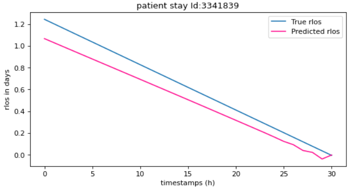
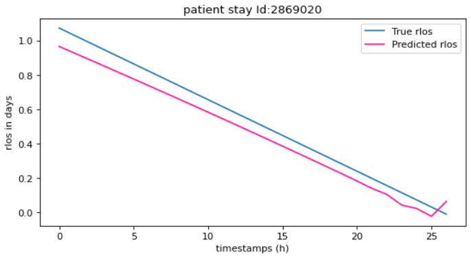
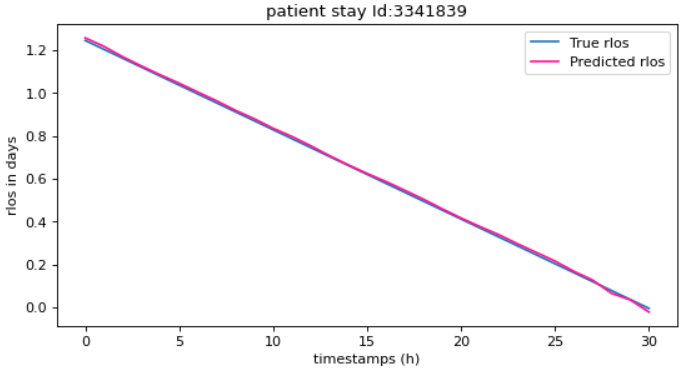
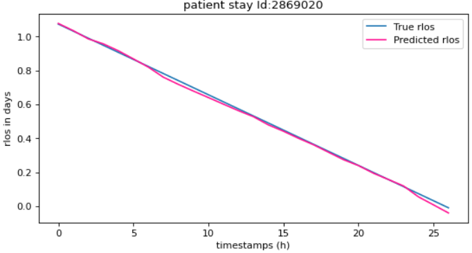

# Analyzing Models in Predicting Length of Stay (LOS) (rLOS) Using Intensive Unit Care Dataset

A detailed explanation of our experiments and results can be found in `project.pdf`. In this README file, we include instructions on how to run the code.


## Citation
If you use this code or the models in your research, please cite the following:

```
@misc{marziehphi,
  author = {Farahani, Marzieh},
  title = {Reverse Time Attention Networks for Length of Stay Prediction in the Intensive Care Unit},
  year = {2022},
  publisher = {GitHub},
  journal = {GitHub repository},
  howpublished = {\url{https://github.com/marziehphi/RETAIN-LoS-Prediction}},
}
```


## Motivation

The pressure of ever-increasing patient demand and budget restrictions make hospital bed management a daily challenge for clinical staff. Most critical is the efficient allocation of resource-heavy Intensive Care Unit (ICU) beds to the patients who need life support. Central to solving this problem is knowing for how long the current set of ICU patients are likely to stay in the unit. In this work, we propose a new deep learning model based on Reverse Time Attention (RETAIN).


## Headline Results

We report on the following metrics: 
- Mean absolute error (MAE)
- Root Mean squared error (RMSE)
- Mean squared error (MSE)
- Coefficient of determination (R<sup>2</sup>)
  
For the first three metrics, lower is better. For the last one, higher is better.


### Length of Stay Prediction

Knowing the LOS is comparable to knowing the rLOS since the current offset is always known, despite the fact that the targets predicted by baseline models. By having access to the most recent data, it is evident that simple regression models are capable of matching, outperforming, the performance. And, the last record contains practically all of the patient's records' predictive potential.

Model | MAE | MSE | R<sup>2</sup> 
--- | --- | --- | --- 
DT – Optimized (first record) | 0.06 | 2.896 | 0.865 
RFR – Optimized (first record)  | 0.02 |1.639 | 0.923


### Remaining Length of Stay Prediction

The Reverse Time Attention (RETAIN) model is an interpretable alternative to RNNs which was proposed in RETAIN: An Interpretable Predictive Model for Healthcare using Reverse Time Attention Mechanism. The core concept of RNNs is gating, which is achieved by attention. RETAIN provides an interpretable model by explicitly finding record-level (corresponding to each time step) and feature-level (corresponding to each feature at a time step) attention values, as a function of the embedding, which is a linear function of the input features. As with all attention, these values are multiplied pointwise to the values of the embedding, and each gated embedding is mapped to the output, which is the rLOS in our case.


Model | MAE | RMSE | R<sup>2</sup> 
--- | --- | --- | --- 
BiLSTM | 0.841  | 2.794  | 0.701
BiRETAIN | 0.036 | 0.050  | 0.980

#### BiLSTM Prediction Result 



#### BiRETAIN Prediction Result




## Preprocessing Data
 In the folder eICU_preprocessing you could find all the information needed for this stage. 

## Training and Testing Baseline Models
```
python3 -m models.baselines_models --dataset_path path-to-database-directory --model type_mode(RFR) --log_file path-to-logs-directory 
```

## Training and Testing Advance Models
```
python3 -m model.train_nn --path path-to-database --model name-of-model-to-train [--epochs number-of-training-epochs] [--lr learning-rate] [--no_cuda] [--reverse_input]
```
```
python3 -m models.test_nn--path path-to-database --model_path path-to-trained-model [--no_cuda] [--reverse_input] [--tag tag-to-add-to-results-filename]
```

The arguments shown in square brackets are optional. `no_cuda` runs code on the CPU, while omitting the flag will default to using CUDA. `reverse_input` reverses the order of records when feeding examples to the model. This flag is only relevant when using LSTM and RETAIN models.

